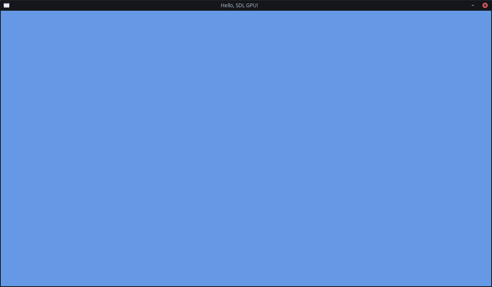

# Chapter 1: Blank Screen

In this chapter, we will create a simple application with a game loop and a colored window.

## Game Loop

SDL3 provides a simple, highly cross-platform way to create a game loop,
through its "[Main Callbacks](https://wiki.libsdl.org/SDL3/README-main-functions)" system.
In this guide, we will use that to keep our code simple and portable.

So remove any existing code in your `main.cpp` file, and replace it with the following:

```c++
#include <SDL3/SDL.h>
#define SDL_MAIN_USE_CALLBACKS
#include <SDL3/SDL_main.h>

// This function runs once at startup
SDL_AppResult SDL_AppInit(void** appstate, int argc, char* argv[])
{
	SDL_Log("Init");
	// Continue running the program
	return SDL_APP_CONTINUE;
}

// This function runs when a new event (mouse input, keypresses, etc) occurs
SDL_AppResult SDL_AppEvent(void* appstate, SDL_Event* event)
{
	SDL_Log("Event");
	switch (event->type)
	{
	case SDL_EVENT_QUIT:
		// Quit the program with a success state
		return SDL_APP_SUCCESS;
	default:
		// Continue running the program
		return SDL_APP_CONTINUE;
	}
}

// This function runs once per frame, and is the heart of the program
SDL_AppResult SDL_AppIterate(void* appstate)
{
	SDL_Log("Iterate");
	// Continue running the program
	return SDL_APP_CONTINUE;
}

// This function runs once at shutdown
void SDL_AppQuit(void* appstate, SDL_AppResult result)
{
	SDL_Log("Quit");
}
```

This will log a message "Init" once, at the start of the application,
"Event" every time an event like mouse or keyboard input comes in (many times per frame),
"Iterate" once every single frame, and "Quit" once at the end.

In the next section, we will start replacing these logs with actual code.

## Window

Before we start by creating the window in which we will draw all our stuff,
we first need a place to store the pointer to that window.

Above the callback functions, create a struct:

```c++
struct MyAppState
{
	SDL_Window* window = nullptr;
};
```

Now, in the `SDL_AppInit` function, create an instance of it on the heap and pass it to SDL for safekeeping:

```c++
MyAppState* myAppState = new MyAppState();
*appstate = myAppState;
```

We can then create the window and store it in our struct instance:

```c++
myAppState->window = SDL_CreateWindow("Hello, SDL GPU!", 1280, 720, 0);
if (myAppState->window == nullptr)
{
	SDL_Log("Couldn't create window: %s", SDL_GetError());
	return SDL_APP_FAILURE;
}
```

Don't forget to check for errors!

If you run the program now, you will see a blank/black screen that you can close with the X button.

## GPU Device

Now that we have a window, we can create a "graphics context" in it, with which we will draw things to it.

Add a field to store that in the `MyAppState` struct to store a pointer to the GPU Device:

```c++
struct MyAppState
{
	SDL_Window* window = nullptr;
	SDL_GPUDevice* device = nullptr;
};
```

Now we can create the actual GPU Device.

To do this, we first need to make a decision.
Because SDL's GPU API is a wrapper over multiple platform APIs that all take shaders in a different format,
we need to choose which shader formats we, as application developers, will provide to the GPU API.
See [this wiki page](https://wiki.libsdl.org/SDL3/SDL_GPUShaderFormat) for a full list.
For this chapter, it doesn't really matter what you fill in, yet, because we won't be writing shaders yet,
so for now, we will just write that we support Vulkan, DirectX and Metal, which are the main big three.

The second argument, the boolean, tells SDL whether we enable "debug mode" on that device.
For the duration of this guide, this will be `true`.
When you ship your application, you should probably set that to `false`, though.

The last argument tells SDL which GPU driver it should use.
It's best to keep that as `nullptr`, to let SDL pick the optimal driver.

```c++
SDL_GPUShaderFormat formatFlags = SDL_GPU_SHADERFORMAT_SPIRV | SDL_GPU_SHADERFORMAT_DXIL | SDL_GPU_SHADERFORMAT_MSL;
myAppState->device = SDL_CreateGPUDevice(formatFlags, true, nullptr);
if (myAppState->device == nullptr)
{
	SDL_Log("Couldn't create GPU device: %s", SDL_GetError());
	return SDL_APP_FAILURE;
}
```

Now that we have created the GPU Device, we need to link that GPU Device to the Window we created earlier:

```c++
if (!SDL_ClaimWindowForGPUDevice(myAppState->device, myAppState->window))
{
	SDL_Log("Couldn't claim window for GPU device: %s", SDL_GetError());
	return SDL_APP_FAILURE;
}
```

## Command Buffers

To now control the GPU Device that we have a pointer to, we must create so-called "command buffers".
These are objects that you fill with GPU commands on the CPU, and then send to the GPU in one go, to be processed.
The CPU can then continue with its job, while the GPU is doing _its_ job.
This way, the two can neatly work in parallel.

In `SDL_AppIterate`, get the pointer to your MyAppState instance back from SDL:

```c++
MyAppState* myAppState = static_cast<MyAppState*>(appstate);
```

Then, with the `device` property from there that we stored earlier,
we can request a command buffer from SDL that we will fill with some render commands:

```c++
SDL_GPUCommandBuffer* commandBuffer = SDL_AcquireGPUCommandBuffer(myAppState->device);
if (commandBuffer == nullptr)
{
	SDL_Log("AcquireGPUCommandBuffer failed: %s", SDL_GetError());
	return SDL_APP_FAILURE;
}
```

Now of course, the things that we see in the window are images. These are stored as textures on the GPU, in its VRAM.
There are usually _multiple_ screen textures in what is called the "swapchain".
Because they're stored in a metaphorical chain; a loop, which is swapped between.

While the screen is displaying a texture, the GPU is writing to the next one already.
Once the GPU is done writing, the textures are swapped, and the screen displays the fresh texture,
while the GPU starts writing to the old texture that was displayed last frame.

SDL manages that swapchain for us, so we can simply get the texture
that we need to write to for this frame in a single function call.

The two `nullptr`s are for the dimensions of the depth buffer. This is something we will be worrying about later.

```c++
SDL_GPUTexture* swapchainTexture;
if (!SDL_WaitAndAcquireGPUSwapchainTexture(commandBuffer, myAppState->window, &swapchainTexture, nullptr, nullptr))
{
	SDL_Log("WaitAndAcquireGPUSwapchainTexture failed: %s", SDL_GetError());
	return SDL_APP_FAILURE;
}
```

Sometimes, SDL does not actually have a swapchain texture ready for you to fill with a frame,
denoted by the pointer being a `nullptr`. In those cases, you should not draw anything.
You can just wrap your drawing with a simple if-statement: `if (swapchainTexture != nullptr)`.

Now for the best part: actually drawing something to the screen, through that swapchain texture.
For now, we will just fill that texture with a solid color.

## Render Passes

As part of the Command Buffer, we can make "Passes".
Two types of "Pass" exist: "Render Pass" and "Compute Pass".
For now, we will stick to Render Passes only.
With these Passes, you build the actual lowest level commands to the GPU.
You can have as many passes as you'd like per Command Buffer.

Now I should mention, modern GPU APIs often work with big structs with lots of options that you can fill in.
Then you pass that struct with all your options into the function.
This prevents functions from having dozens of arguments and overloads/alternatives in case of optional options.

Here we encounter our first one: [`SDL_GPUColorTargetInfo`](https://wiki.libsdl.org/SDL3/SDL_GPUColorTargetInfo)
This struct contains the information about which texture the next Render Pass will apply to,
which colors it will use, and what it will do to and with the colors.

For now, it's pretty simple.
The `texture` is the swapchain texture we got earlier, and the `clear_color` is whatever color you like,
passed through as an [`SDL_FColor`](https://wiki.libsdl.org/SDL3/SDL_FColor).

The `load_op` is what we do with the data that's currently already in the texture.
Here, we just want to clear it all, because we are about to overwrite it with the data for the next frame,
so we set it to `SDL_GPU_LOADOP_CLEAR`.

The `store_op` is what we want to do with the data that we want to write to it.
Here, we just want to overwrite everything with our new data,
so we set it to `SDL_GPU_STOREOP_STORE`.

You can read about the other options you can use here
on [this page](https://wiki.libsdl.org/SDL3/SDL_GPUColorTargetInfo).

More options aren't necessary for now, so we end up with this:

```c++
SDL_GPUColorTargetInfo colorTargetInfo = {
	.texture = swapchainTexture,
	.clear_color = SDL_FColor{0.4f, 0.6f, 0.9f, 1.0f},
	.load_op = SDL_GPU_LOADOP_CLEAR,
	.store_op = SDL_GPU_STOREOP_STORE,
};
```

You could also write fill in these types of structs like this, instead, if you prefer:

```c++
SDL_GPUColorTargetInfo colorTargetInfo = { 0 };
colorTargetInfo.texture = swapchainTexture;
colorTargetInfo.clear_color = (SDL_FColor){ 0.4f, 0.6f, 0.9f, 1.0f };
colorTargetInfo.load_op = SDL_GPU_LOADOP_CLEAR;
colorTargetInfo.store_op = SDL_GPU_STOREOP_STORE;
```

Personally, I prefer the former, so that is what this guide will use.
But please don't hesitate to use the other format instead when typing over this code!  
_You're not copy-pasting, are you? ;)_

Now that we have our `colorTargetInfo` struct filled in, we can give it to the Render Pass.
It can take an array of multiple `SDL_GPUColorTargetInfo`s, but we just have one at the moment,
so we just give the pointer to the one, and give `1` to the third `num_color_targets` argument.
The last argument is for the depth buffer, which we won't concern ourselves with yet, so we can just set it to
`nullptr`.

```c++
SDL_GPURenderPass* renderPass = SDL_BeginGPURenderPass(commandBuffer, &colorTargetInfo, 1, nullptr);
SDL_EndGPURenderPass(renderPass);
```

Later on, we will also put stuff in between the start and the end of the render pass, but for now, this is all we need.

And then finally, outside the swapchain's if-statement again, we can say we are done with filling in the command buffer.
While saying that, we also finally send it off to the GPU for processing.
```c++
SDL_SubmitGPUCommandBuffer(commandBuffer);
```

Right now, you could already run the code, but we haven't done out cleanup yet, so hold on for a few more moments!

## Cleanup
In your `SDL_AppQuit` function, get the pointer to your MyAppState instance back from SDL:

```c++
MyAppState* myAppState = static_cast<MyAppState*>(appstate);
```

With that, we can now deattach the GPU Device from the Window again:
```c++
SDL_ReleaseWindowFromGPUDevice(myAppState->device, myAppState->window);
```

And then clean them up:
```c++
SDL_DestroyWindow(myAppState->window);
SDL_DestroyGPUDevice(myAppState->device);
delete myAppState;
```

Now, hopefully, you should be able to run the application, and see a nice cornflower blue window!



[Example Code](../../example/chapter01)

[← Previous Chapter](../chapter00/README.md) | [Index](../README.md) | [Next Chapter →](../chapter02/README.md)
