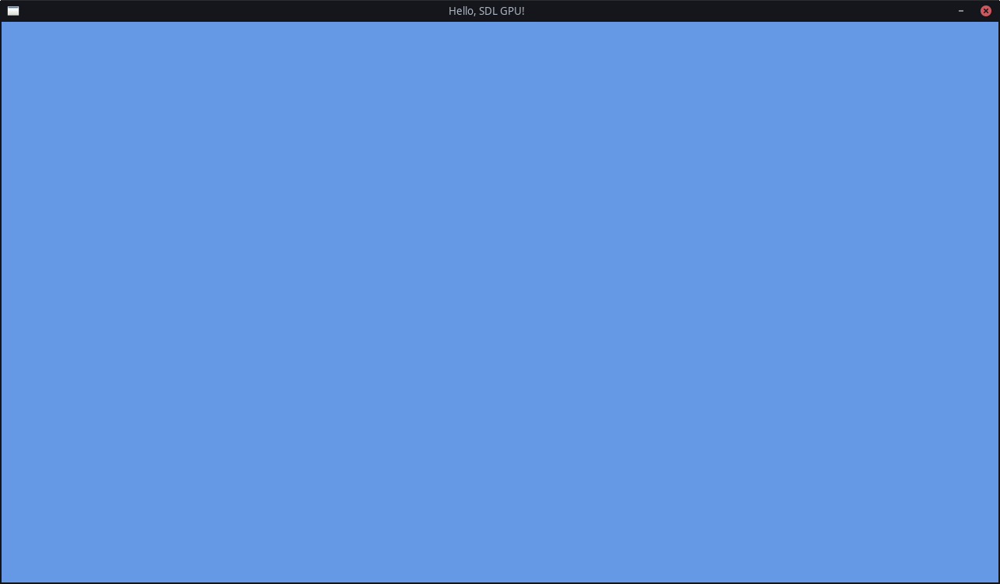

# Chapter 2: Blank Screen

In this chapter, we will give the window we created in the last chapter a color, instead of black.

## GPU Device

Before we can start drawing stuff into the window we created last chapter,
we need to make a connection to the GPU Device that is inside the computer.

Note that essentially all modern computers have a GPU, because this does not count only dedicated GPUs.  
It also works with integrated GPUs!

We will need this GPU Device pretty often, throughout our code,
so add a field to the `MyAppState` struct to store a pointer to the GPU Device:

```c++
struct MyAppState
{
	SDL_Window* window = nullptr;
	SDL_GPUDevice* device = nullptr;
};
```

Now we can create the actual connection to the GPU Device.

To do this, we first need to make a decision.
For some parts of the rendering, we will need to write some GPU programs: shaders.
In the introduction, I mentioned that SDL's GPU API is a wrapper over multiple platform APIs.
These platform APIs all take these shaders in a their own formats,
so we need to choose which shader formats we, as application developers, will provide.  
For this chapter, it doesn't really matter what you fill in, because we won't actually be writing any shaders yet.  
So for now, we will just write that we support all three desktop platform APIs: Vulkan, DirectX and Metal. 
See [this SDL wiki page](https://wiki.libsdl.org/SDL3/SDL_GPUShaderFormat) for the full list of the shader formats you can support.

The second argument, the boolean, tells SDL whether we enable "debug mode" on that device.
For the duration of this guide, this will be `true`.
When you ship your application, you will want to set that to `false`, though.

The last argument tells SDL which GPU driver it should use.
It's best to keep that as `nullptr`, to let SDL pick the optimal driver.

```c++
SDL_GPUShaderFormat formatFlags = SDL_GPU_SHADERFORMAT_SPIRV | SDL_GPU_SHADERFORMAT_DXIL | SDL_GPU_SHADERFORMAT_MSL;
myAppState->device = SDL_CreateGPUDevice(formatFlags, true, nullptr);
if (myAppState->device == nullptr)
{
	SDL_Log("Couldn't create GPU device: %s", SDL_GetError());
	return SDL_APP_FAILURE;
}
```

Now that we have created the GPU Device, we need to link that GPU Device to the Window we created earlier:

```c++
if (!SDL_ClaimWindowForGPUDevice(myAppState->device, myAppState->window))
{
	SDL_Log("Couldn't claim window for GPU device: %s", SDL_GetError());
	return SDL_APP_FAILURE;
}
```

## Command Buffers

To now control the GPU Device that we have a pointer to, we must create so-called "command buffers".
These are objects that you fill with GPU commands on the CPU, and then send to the GPU in one go, to be processed.
The CPU can then continue with its job, while the GPU is doing _its_ job.
This way, the two can neatly work in parallel.

In `SDL_AppIterate`, get the pointer to your MyAppState instance back from SDL:

```c++
MyAppState* myAppState = static_cast<MyAppState*>(appstate);
```

Then, with the `device` property from there that we stored earlier,
we can request a command buffer from SDL that we will fill with some render commands:

```c++
SDL_GPUCommandBuffer* commandBuffer = SDL_AcquireGPUCommandBuffer(myAppState->device);
if (commandBuffer == nullptr)
{
	SDL_Log("Couldn't acquire GPU command buffer: %s", SDL_GetError());
	return SDL_APP_FAILURE;
}
```

As you probably know, things on the computer are rendered frame by frame,
to give the illusion of movement by showing slightly different images in quick succession. 
These are images stored as textures on the GPU, in its own memory, the VRAM.
There are usually _multiple_ screen textures in what is called the "swapchain".
Because they're stored in a metaphorical chain; a loop, which is swapped between.

While the screen is displaying a texture, the GPU is writing to the next one already.
Once the GPU is done writing, the textures are swapped, and the screen displays the fresh texture,
while the GPU starts writing to the old texture that was displayed last frame.

SDL manages that swapchain for us, so we can simply request the texture
that we need to write to for this frame in a single function call.

The two `nullptr`s are for the dimensions of the depth buffer. This is something we will be worrying about later.

```c++
SDL_GPUTexture* swapchainTexture;
if (!SDL_WaitAndAcquireGPUSwapchainTexture(commandBuffer, myAppState->window, &swapchainTexture, nullptr, nullptr))
{
	SDL_Log("Couldn't acquire swapchain texture: %s", SDL_GetError());
	return SDL_APP_FAILURE;
}
```

Sometimes, SDL does not actually have a swapchain texture ready for you to fill with a frame,
denoted by the pointer being a `nullptr`. In those cases, you should not draw anything.
You can just wrap your drawing with a simple if-statement: `if (swapchainTexture != nullptr)`.

Now for the best part: actually drawing something to the screen, through that swapchain texture.
For now, we will just fill that texture with a solid color.

## Render Passes

As part of the Command Buffer, we can make "Passes".
Two types of "Pass" exist: "Render Pass" and "Compute Pass".
For now, we will stick to Render Passes only.
With these Passes, you build the actual lowest level commands to the GPU.
You can have as many passes as you'd like per Command Buffer.

Now I should mention, modern GPU APIs often work with big structs with lots of options that you can fill in.
Then you pass that struct with all your options into the function.
This prevents functions from having dozens of arguments and overloads/alternatives in case of optional options.

Here we encounter our first struct with options: [`SDL_GPUColorTargetInfo`](https://wiki.libsdl.org/SDL3/SDL_GPUColorTargetInfo)
This struct contains the information about which texture the next Render Pass will apply to,
which colors it will use, and what it will do to and with the colors.

For now, it's pretty simple.
The `.texture` is the swapchain texture we got earlier,
and the `.clear_color` is whatever color you like, passed through as an
[`SDL_FColor`](https://wiki.libsdl.org/SDL3/SDL_FColor).

The `.load_op` is what we do with the data that's currently already in the texture.
Here, we just want to clear it all to the color we provided above,
so we set it to `SDL_GPU_LOADOP_CLEAR`.
With this, you get a nice clean slate to render new stuff on top of.

_An optimization you could potentially make later on,
when you start drawing custom skyboxes or something like that,
is setting this to `SDL_GPU_LOADOP_DONT_CARE`.  
With a custom skybox, you don't need an explicitly clean slate
as you'll be drawing your own skybox overtop immediately anyway._

The `.store_op` is what we want to do with the data we have.
Here, we just want to overwrite everything with our new data,
so we set it to `SDL_GPU_STOREOP_STORE`.

You can always check the SDL documentation to see any other options you can use and their purposes.  
In the case of `SDL_GPUColorTargetInfo`, that is on
[this page](https://wiki.libsdl.org/SDL3/SDL_GPUColorTargetInfo).

More options aren't necessary for now, so we end up with this:

```c++
SDL_GPUColorTargetInfo colorTargetInfo = {
	.texture = swapchainTexture,
	.clear_color = SDL_FColor{0.4f, 0.6f, 0.9f, 1.0f},
	.load_op = SDL_GPU_LOADOP_CLEAR,
	.store_op = SDL_GPU_STOREOP_STORE,
};
```

You could also write these types of structs like this, instead, if you prefer:

```c++
SDL_GPUColorTargetInfo colorTargetInfo = { 0 };
colorTargetInfo.texture = swapchainTexture;
colorTargetInfo.clear_color = (SDL_FColor){ 0.4f, 0.6f, 0.9f, 1.0f };
colorTargetInfo.load_op = SDL_GPU_LOADOP_CLEAR;
colorTargetInfo.store_op = SDL_GPU_STOREOP_STORE;
```

Personally, I prefer the former, so that is what this guide will use.
But please don't hesitate to use the other format instead when typing over this code!  
_You're not copy-pasting, are you? ;)_

Now that we have our `colorTargetInfo` struct filled in, we can give it to the Render Pass.
It can take an array of multiple `SDL_GPUColorTargetInfo`s, but we just have one at the moment,
so we just give the pointer to the one, and give `1` to the third `num_color_targets` argument.
The last argument is for the depth buffer, which we won't concern ourselves with yet, so we can just set it to
`nullptr`.

```c++
SDL_GPURenderPass* renderPass = SDL_BeginGPURenderPass(commandBuffer, &colorTargetInfo, 1, nullptr);
SDL_EndGPURenderPass(renderPass);
```

Later on, we will also put stuff in between the start and the end of the render pass, but for now, this is all we need.

And then finally, outside the swapchain's if-statement again, we can say we are done with filling in the command buffer.
While saying that, we also finally send it off to the GPU for processing.

```c++
SDL_SubmitGPUCommandBuffer(commandBuffer);
```

Right now, you could already run the code, but we haven't done out cleanup yet, so hold on for a few more moments!

## Cleanup

In your `SDL_AppQuit` function, get the pointer to your MyAppState instance back from SDL:

```c++
MyAppState* myAppState = static_cast<MyAppState*>(appstate);
```

With that, we can now deattach the GPU Device from the Window again:

```c++
SDL_ReleaseWindowFromGPUDevice(myAppState->device, myAppState->window);
```

And then clean them up:

```c++
SDL_DestroyWindow(myAppState->window);
SDL_DestroyGPUDevice(myAppState->device);
delete myAppState;
```

Now, hopefully, you should be able to run the application, and see a nice cornflower blue window!



[Final Chapter Code](https://github.com/TechnicJelle/GPUForBeginners/blob/main/chapters/chapter02/main.cpp)

[← Previous Chapter](../chapter01/README.md) | [Index](../README.md) | [Next Chapter →](../chapter03/README.md)
