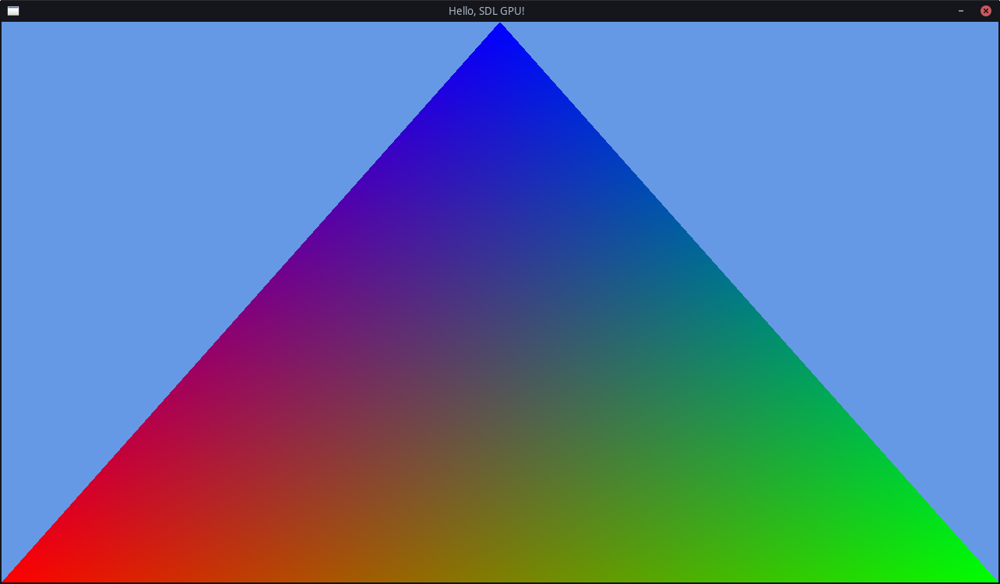

# Chapter 3: Rainbow Triangle

In this chapter, we will give the triangle some color,
with a technique called "Vertex Colors".

This used to be very popular back in the day, before using textures was as cheap as it is now.
Many engines and frameworks still have the functionality,
but nowadays graphics programmers usually use it to transfer other data than actual colors.  
Still, it is a good place to start, as it teaches how to transfer more arbitrary data to the GPU with each vertex.

```c++
struct float3
{
	float x, y, z;
};

struct Vertex
{
	float3 position;
};
```

```hlsl
struct Input
{
	float3 Position : TEXCOORD0;
};

struct Output
{
	float4 Position : SV_Position;
};

Output main(Input input)
{
	Output output;
	output.Position = float4(input.Position, 1.0f);

	return output;
}
```




[Final Chapter Code](https://github.com/TechnicJelle/GPUForBeginners/blob/main/chapters/chapter03/)

[← Previous Chapter](../chapter02/README.md) | [Index](../README.md) | [Next Chapter →](../chapter04/README.md)
