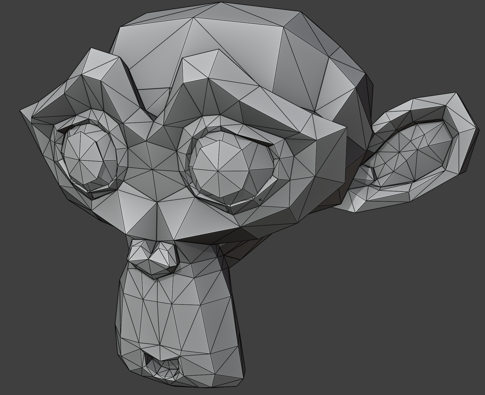
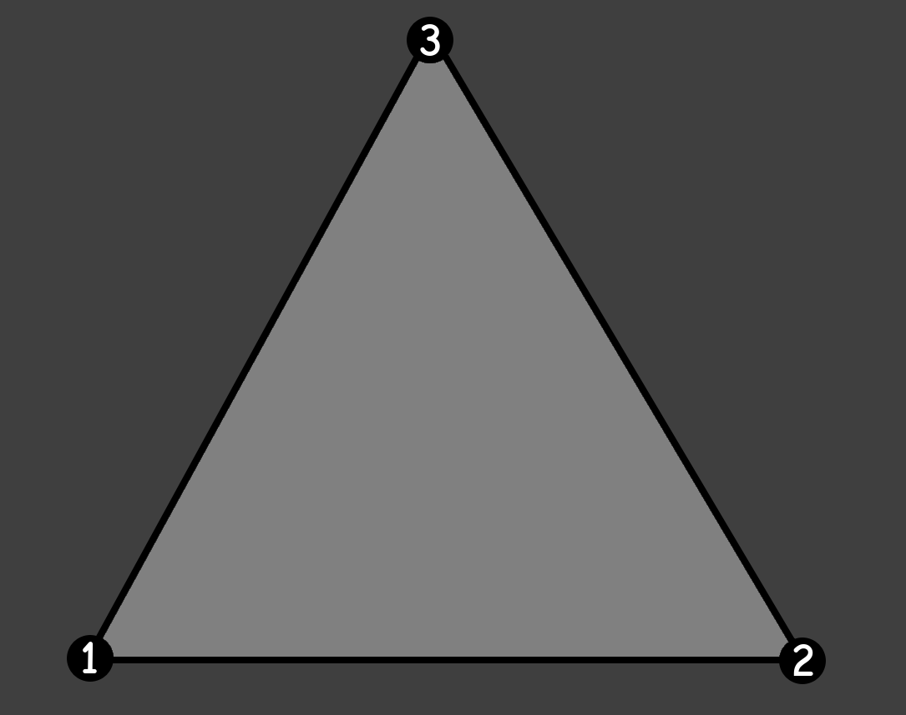
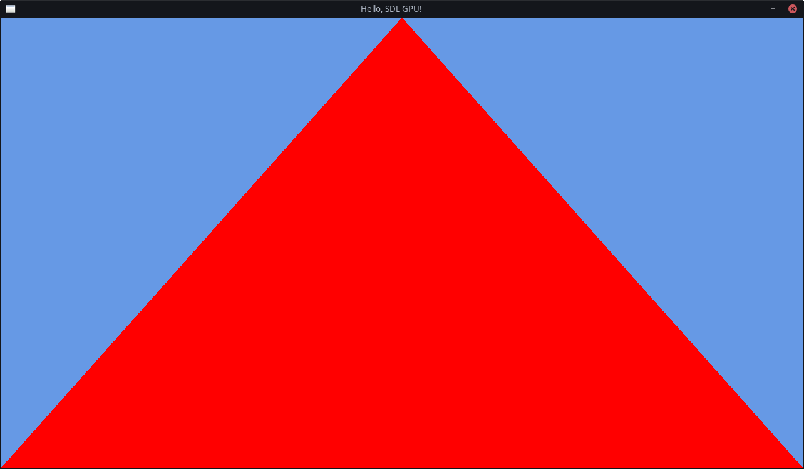

# Chapter 3: First Triangle

To get a 3D model onto our screen, we first need to know what 3D models are made up of.

The simple answer to that is: Triangles.



Triangles are the most basic geometric shape, and almost all 3D is made up of them.  
_(Unless you use things like SDFs or some types of Voxel Rendering, but that is outside the scope of this guide.)_

So all graphics programming starts with the first triangle.
In this chapter, we will get our first triangle onto the screen.

This is a long chapter, because there are many new concepts to be learnt
and quite a bit of infrastructure to be set up beforehand.  
Please do not get discouraged!

## Vertices

Each triangle is made up of three vertices; three points in space.



The order of the vertices is important, because the order decides which way the triangle is facing.
Knowing that allows for optimizations we will get into later.

We can define what a Vertex is in our code by making a struct with three floats:

```c++
struct Vertex
{
	float x, y, z;
};
```

## Pipelines

Modern GPUs with modern GPU programming work very much like pipelines:
data goes in, transformed data comes out.

When rendering, we use Graphics Pipelines.
There, the input is our vertices and the output is a picture.

But there are also pipelines for more generic data transformation: Compute Pipelines.
There, the input and output can be entirely programmed manually.
They are very useful, but for now we will stick to Graphics Pipelines.

Graphics Pipelines have multiple stages that the data goes through.
Most of these stages have options that need to be set for the data to go through correctly.

### Shaders

A few of the stages can even be fully programmed with GPU programs called "shaders".  
SDL's GPU API exposes two of these shaders:

- Vertex Shader: This GPU program transforms the vertex positions to be in the correct place in the world.
    - This runs for each vertex you pass to the GPU.
- Fragment Shader: This GPU program decides which pixels become which color.
    - This runs for each fragment (essentially the same as a pixel) on the screen.

Do not be alarmed by the fact that it runs these shaders so many times!
GPUs are _heavily_ parallel devices with hundreds or even thousands of cores.

Some (older) GPU APIs included a compiler for shader code in their drivers,
but modern GPU APIs delegate shader compilation to the application developers instead.

Shaders can be programmed in many languages, and the format that they have to be compiled to differs per platform.  
_For more background information on why shader compilation is like this, read
[this article](https://moonside.games/posts/layers-all-the-way-down/) from the developers of the SDL GPU API._

For this guide, we will be writing shaders in the shader language HLSL,
because it is the most common shader language in the industry.  
Another language that exists is GLSL, which is more common with older GPU APIs and in hobbyist spaces.

HLSL is pretty similar to C and C++, so you should be able to pick it up pretty quickly.

#### Compiler

To handle all the different output formats we may need for each platform,
we will be using a shader compiler developed for use alongside the SDL GPU API:
[SDL_shadercross](https://github.com/libsdl-org/SDL_shadercross).  
It is **not required** to use SDL_shadercross when using the SDL GPU API, but it _is recommended_.

We need to download Shadercross manually, because it is not part of SDL itself.
This is because it combines many shader compilers for all supported platforms into one easy-to-use tool,
which would have made SDL way too big.

Shadercross is available as both a CLI Tool and as a library.  
In this guide, we will be using the CLI Tool.  
The library is useful if you want to compile your shaders at runtime, instead of at compile-time.
For most projects, this is not necessary.  
Though, it could be useful for hot-reloading during development.

At the time of writing, SDL_shadercross does not have an official release yet,
but you can download the latest build from its
[**Actions** Tab](https://github.com/libsdl-org/SDL_shadercross/actions).  
Make sure to get the latest successful build and to download the artifact for your specific platform.

You can find the CLI tool executable in the `bin/` folder.  
If you like, you can add this folder to your PATH, so you can easily call it from anywhere.

#### Code

We will start at the front of the graphics pipeline, with the Vertex Shader.

##### Vertex Shader

Create a new file, called `OnlyPosition.vert.hlsl`.
(The shader stage is usually included in the file name of shaders.)

Input and output variables in HLSL are defined by their type, followed by their name, then a colon,
and lastly their "location".
SDL's GPU API [prescribes](https://wiki.libsdl.org/SDL3/SDL_CreateGPUShader)
that the name of the location is "`TEXCOORD`" followed by a number. You can generally just increment this one by one.

So, we will define what we have as our input to this shader like this:

```hlsl
struct Input
{
	float x : TEXCOORD0;
	float y : TEXCOORD1;
	float z : TEXCOORD2;
};
```

Notice that this is essentially the same as the Vertex struct we made earlier in C++,
except with the addition of the locations.  
You should always make sure that the CPU (C++) and GPU (HLSL) agree on what a vertex is!

Then we define the output for the shader:

```hlsl
struct Output
{
	float4 Position : SV_Position;
};
```

Here we see two new things: "`float4`" and "`SV_Position`".
The `SV_Position` location is the location of the position output of the
HLSL has some more types than C++ has for packed data of the same type.

You could consider these as structs themselves, where the values can be accessed through various names,
like union structs.  
Common patterns are `float3.x`, `float3.y`, `float3.z`.  
But also `float4.r`, `float4.g`, `float4.b`, `float4.a`.  
Here `float3.x` is the same as `float3.r`. It's just a different name for the same value.
This is helpful in situations where you're using the same data type for different purposes,
like coordinates and colors.

They are very useful to the same operation on multiple pieces of data at the same time.
We will use them more in the next chapter.

By the way, yes, you saw that correctly: we are using a 4D data structure here instead of a 3D one.
This is used for some perspective mathematics that we will cover later.
The last value of the `float4` for positions is called `w`.

Now that we have our input and output defined, we can write our main function.

We create an instance of the `Output` struct and name it `output`.
Then we set the `.Position` of the `output` to a new `float4` with the xyz from the `input`.
The `w`, we can just set to `1.0f` for now.

Once we have filled in the output fully, we can return it.

```hlsl
Output main(Input input)
{
	Output output;
	output.Position = float4(input.x, input.y, input.z, 1.0f);

	return output;
}
```

##### Fragment Shader

Now we can write our second shader: the Fragment Shader.

Create a new file, called `SolidColor.frag.hlsl`.

Again, we define two structs: `Input` and `Output`.  
However, the `Input` struct is empty, because we don't have any inputs yet.  
The `Output` struct has a `float4 Color : SV_Target0`.

The main function has the same signature again, and also mostly the same content.
Except here we set _all_ the values of the `float4`, which is also a color now, instead of a position.  
Colors in HLSL are usually `float`s between `0.0f` and `1.0f`. (Not 0 to 255!)

Choose any color you like, but make sure that the alpha is set to 1.
I will set it to red, here.

So our resulting fragment shader code is:

```hlsl
struct Input
{
};

struct Output
{
	float4 Color : SV_Target0;
};

Output main(Input input)
{
	Output output;
	output.Color = float4(1.0f, 0.0f, 0.0f, 1.0f);

	return output;
}
```

#### Compilation

Now that we have our two shader files, we can compile them!

Open a terminal/console make sure you can run the CLI and you can access the HLSL files.

First, we pass the name of the HLSL file as our input,
and we can set the output file name/path with the `-o` flag.

Do you remember the `SDL_GPUShaderFormat` flags we passed into `SDL_CreateGPUDevice`?
These are the platforms you decide to support, as application developer.  
You have to run the tool for each shader file you have and then for each platform you want to support.

Shadercross will automatically deduce which platform you're trying to compile to
by the file name you give the output.

- Vulkan: `.spv`
- DirectX: `.dxil`
- Metal: `.msl`

If you want to support all desktop platforms, you need to run the compiler six times:

```bash
shadercross "OnlyPosition.vert.hlsl" -o "OnlyPosition.vert.spv"
shadercross "OnlyPosition.vert.hlsl" -o "OnlyPosition.vert.dxil"
shadercross "OnlyPosition.vert.hlsl" -o "OnlyPosition.vert.msl"

shadercross "SolidColor.frag.hlsl" -o "SolidColor.frag.spv"
shadercross "SolidColor.frag.hlsl" -o "SolidColor.frag.dxil"
shadercross "SolidColor.frag.hlsl" -o "SolidColor.frag.msl"
```

Place the compiled shader files somewhere your application will be able to access them.
I will store them in a directory called "shaders" next to my executable.

An exercise to the reader: integrate this CLI tool in your build system,
so that it runs every time you change the HLSL code,
and that it puts the compiled files in the correct spot automatically.  
You can look at how I do it
[here](https://github.com/TechnicJelle/GPUForBeginners/blob/ab63d5d11df06466a67ec46a5e8cd51723629203/CMakeLists.txt#L35-L68).

#### Load

Now that we have compiled the shaders into the various formats the platform(s) might need,
we need to make our application actually load them in!

Create a new function above `SDL_AppInit()`:
`SDL_GPUShader* LoadShader(SDL_GPUDevice* device, const std::string& shaderFilename)`.

To make an `SDL_GPUShader`, we first need to collect some information about the shader and the current platform.

Firstly, we need to know which stage it is.
Luckily, we included this information in the file name, so we can easily extract it with a `.contains()` call!

```c++
SDL_GPUShaderStage stage;
if (shaderFilename.contains(".vert"))
{
	stage = SDL_GPU_SHADERSTAGE_VERTEX;
}
else if (shaderFilename.contains(".frag"))
{
	stage = SDL_GPU_SHADERSTAGE_FRAGMENT;
}
else
{
	SDL_Log("Couldn't deduce shader stage from file name: %s", shaderFilename.c_str());
	return nullptr;
}
```

Second, we need to know _which_ shader file we need to load, which format it is, and the name of the entry point.

I will use the `std::filesystem::path` class for this, but you can use normal strings if you prefer.  
With `SDL_GetBasePath()`, I get the path to the directory of the executable
and from there I go into the "shaders" directory.

The `SDL_GPUShaderFormat` starts off as `SDL_GPU_SHADERFORMAT_INVALID`, because we don't know yet.

We also need to remember the entry point, which we need as a c-string, so we might as well make it that from the get-go.

```c++
std::filesystem::path fullPath = std::filesystem::path(SDL_GetBasePath()) / "shaders";
SDL_GPUShaderFormat format = SDL_GPU_SHADERFORMAT_INVALID;
const char* entrypoint;
```

Now we ask SDL which platform we're actually running on with `SDL_GetGPUShaderFormats`.
With this, we can fill in the values:

```c++
SDL_GPUShaderFormat backendFormats = SDL_GetGPUShaderFormats(device);
if (backendFormats & SDL_GPU_SHADERFORMAT_SPIRV)
{
	fullPath /= shaderFilename + ".spv";
	format = SDL_GPU_SHADERFORMAT_SPIRV;
	entrypoint = "main";
}
else if (backendFormats & SDL_GPU_SHADERFORMAT_MSL)
{
	fullPath /= shaderFilename + ".msl";
	format = SDL_GPU_SHADERFORMAT_MSL;
	entrypoint = "main0";
}
else if (backendFormats & SDL_GPU_SHADERFORMAT_DXIL)
{
	fullPath /= shaderFilename + ".dxil";
	format = SDL_GPU_SHADERFORMAT_DXIL;
	entrypoint = "main";
}
else
{
	SDL_Log("Couldn't find a supported shader format for backend %s!", SDL_GetGPUDeviceDriver(device));
	return nullptr;
}
```

Now that we know which file we need to load and from where, we can load it.
If you like, you can use C++'s `std::ifstream` for this (make sure to load it as binary),
but I actually prefer SDL's API for loading files, so I will use that.

```c++
size_t fileSize;
void* code = SDL_LoadFile(fullPath.string().c_str(), &fileSize);
if (code == nullptr)
{
	SDL_Log("Couldn't load shader file from disk!\n\t%s", SDL_GetError());
	return nullptr;
}
```

Now we finally have all the information we need to create the shader!

```c++
SDL_GPUShaderCreateInfo shaderInfo = SDL_GPUShaderCreateInfo{
	.code_size = fileSize,
	.code = static_cast<Uint8*>(code),
	.entrypoint = entrypoint,
	.format = format,
	.stage = stage,
};
SDL_GPUShader* shader = SDL_CreateGPUShader(device, &shaderInfo);
if (shader == nullptr)
{
	SDL_Log("Couldn't create shader from file %s: %s", fullPath.c_str(), SDL_GetError());
	SDL_free(code);
	return nullptr;
}
```

Make sure to free the `code` you loaded from disk with `SDL_free()`.
SDL will have made a copy of it for its own internal usage.

You can then finally return the `shader` you got.

### Create the Pipeline

Create a new function above `SDL_AppInit()`:
`bool CreatePipeline(MyAppState* myAppState)`.  
This function returns true on success, false on failure.

Inside, we first load our two shaders:

```c++
SDL_GPUShader* vertexShader = LoadShader(myAppState->device, "OnlyPosition.vert");
if (vertexShader == nullptr)
{
	SDL_Log("Couldn't create vertex shader!");
	return false;
}

SDL_GPUShader* fragmentShader = LoadShader(myAppState->device, "SolidColor.frag");
if (fragmentShader == nullptr)
{
	SDL_Log("Couldn't create fragment shader!");
	return false;
}
```

Then we need to create some arrays with options.
It takes arrays, because you can do some fancy things in bulk here,
but most of our arrays will just contain a single item.

The first array is for "Vertex Buffer Descriptions".
Buffers are essentially blocks of memory on the GPU that store a specific thing.
And as we will be sending our vertices in a "Vertex Buffer", we need to tell the GPU how that memory is laid out.

We need to tell the GPU how big each vertex is, and what the purpose of this buffer is:

```c++
std::array vertexBufferDescriptions{
	SDL_GPUVertexBufferDescription{
		.slot = 0,
		.pitch = sizeof(Vertex),
		.input_rate = SDL_GPU_VERTEXINPUTRATE_VERTEX,
		.instance_step_rate = 0,
	},
};
```

Then, we need to tell the GPU about each field of our Vertex struct; the data type and the location.  
We have three floats, so that is what we fill in.

Notice that the `.location` property matches the `TEXCOORD` number.

The offset is important to prevent overlap.  
You can actually do some fancy things by overlapping data, but that is beyond the scope of this guide.

```c++
std::array vertexAttributes{
	SDL_GPUVertexAttribute{
		.location = 0,
		.buffer_slot = 0,
		.format = SDL_GPU_VERTEXELEMENTFORMAT_FLOAT,
		.offset = 0 * sizeof(float),
	},
	SDL_GPUVertexAttribute{
		.location = 1,
		.buffer_slot = 0,
		.format = SDL_GPU_VERTEXELEMENTFORMAT_FLOAT,
		.offset = 1 * sizeof(float),
	},
	SDL_GPUVertexAttribute{
		.location = 2,
		.buffer_slot = 0,
		.format = SDL_GPU_VERTEXELEMENTFORMAT_FLOAT,
		.offset = 2 * sizeof(float),
	},
};
```

We have now set all the options for the input of the pipeline, but we also need to set an option for the output:
the color format for the swapchain texture that the pipeline will write into:

```c++
std::array colorTargetDescriptions{
	SDL_GPUColorTargetDescription{
		.format = SDL_GetGPUSwapchainTextureFormat(myAppState->device, myAppState->window)
	}
};
```

One last small thing to do before we can create the pipeline, is to prepare some place to store it!
Add a new field in your `MyAppState` struct for the pipeline: `SDL_GPUGraphicsPipeline* pipeline = nullptr;`

Finally, we can create the pipeline.  
We first pass in our shaders, and our Vertex Input State,
which consists of the `vertexBufferDescriptions` and the `vertexAttributes`.

Then, the `.primitive_type` option says what our vertex data actually is.  
Is it a bunch of separate triangles, or are they perhaps connected?
Or are they actually lines or points instead?  
We just have a single triangle for now, so we set it to `SDL_GPU_PRIMITIVETYPE_TRIANGLELIST`.

The `.rasterizer_state` declares how the geometry in the world gets turned into pixels.
For now, we just declare the `.fill_mode`, which controls where the fragment shader is run:
Is it run on the whole triangle (`SDL_GPU_FILLMODE_FILL`), or only the edges (`SDL_GPU_FILLMODE_LINE`)?  
For now, we set it to fill, because we want to see the whole triangle.
But, once you have it all running well, you could try switching it to LINE instead to see how that would look.

Lastly, we have the `.target_info`, which contains our `colorTargetDescriptions`.

```c++
SDL_GPUGraphicsPipelineCreateInfo pipelineCreateInfo = SDL_GPUGraphicsPipelineCreateInfo{
	.vertex_shader = vertexShader,
	.fragment_shader = fragmentShader,
	.vertex_input_state = SDL_GPUVertexInputState{
		.vertex_buffer_descriptions = vertexBufferDescriptions.data(),
		.num_vertex_buffers = vertexBufferDescriptions.size(),
		.vertex_attributes = vertexAttributes.data(),
		.num_vertex_attributes = vertexAttributes.size(),
	},
	.primitive_type = SDL_GPU_PRIMITIVETYPE_TRIANGLELIST,
	.rasterizer_state = SDL_GPURasterizerState{
		.fill_mode = SDL_GPU_FILLMODE_FILL,
	},
	.target_info = SDL_GPUGraphicsPipelineTargetInfo{
		.color_target_descriptions = colorTargetDescriptions.data(),
		.num_color_targets = colorTargetDescriptions.size(),
	},
};
myAppState->pipeline = SDL_CreateGPUGraphicsPipeline(myAppState->device, &pipelineCreateInfo);
if (myAppState->pipeline == nullptr)
{
	SDL_Log("Couldn't create graphics pipeline! %s", SDL_GetError());
	return false;
}
```

Before returning true (for success) from this function,
make sure to release the shaders that you loaded at the start:

```c++
SDL_ReleaseGPUShader(myAppState->device, vertexShader);
SDL_ReleaseGPUShader(myAppState->device, fragmentShader);
```

Call the function at the end of `SDL_AppInit()`:

```c++
if (!CreatePipeline(myAppState))
{
	// Error message already logged in the function
	return SDL_APP_FAILURE;
}
```

## Vertex Buffers

Now that we have told the GPU what we're going to send to it, and in what format,
we need to actually send the data.  
For now, the data we will send is just the three vertices of the triangle.

Create a new function above `SDL_AppInit()`:
`bool CreateVertexBuffer(MyAppState* myAppState, std::span<Vertex> vertices)`.  
This function returns true on success, false on failure.

In here, we first need to store how many vertices we're working with.  
This data is needed later when we're actually rendering the vertices,
so make a new field in you MyAppState struct: `Uint32 numVertices = 0;`.  
We will also need the total size in bytes of the data,
but this one can just be a local variable.

```c++
myAppState->numVertices = vertices.size();
Uint32 verticesSize = myAppState->numVertices * sizeof(Vertex);
```

We will now request the GPU to create a bit of memory for us
in which we can store our data: a "Vertex Buffer".

```c++
SDL_GPUBufferCreateInfo vertexBufferCreateInfo = SDL_GPUBufferCreateInfo{
	.usage = SDL_GPU_BUFFERUSAGE_VERTEX,
	.size = verticesSize,
};
myAppState->vertexBuffer = SDL_CreateGPUBuffer(myAppState->device, &vertexBufferCreateInfo);
if (myAppState->vertexBuffer == nullptr)
{
	SDL_Log("Couldn't create vertex buffer: %s", SDL_GetError());
	return false;
}
```

### Transfer Buffers

To actually put our data into the GPU's memory, we need to transfer it through a "Transfer Buffer".
This is a special buffer that we put our data into on the CPU-side, and then it copies the data to the GPU for us.

```c++
SDL_GPUTransferBufferCreateInfo transferBufferCreateInfo = SDL_GPUTransferBufferCreateInfo{
	.usage = SDL_GPU_TRANSFERBUFFERUSAGE_UPLOAD,
	.size = verticesSize,
};
SDL_GPUTransferBuffer* transferBuffer = SDL_CreateGPUTransferBuffer(myAppState->device, &transferBufferCreateInfo);
if (transferBuffer == nullptr)
{
	SDL_Log("Couldn't create transfer buffer: %s", SDL_GetError());
	return false;
}
```

The Transfer Buffer gives us a pointer to the start of some memory with the length we requested:

```c++
Vertex* transferData = static_cast<Vertex*>(SDL_MapGPUTransferBuffer(myAppState->device, transferBuffer, false));
if (transferData == nullptr)
{
	SDL_Log("Couldn't map transfer buffer: %s", SDL_GetError());
	SDL_ReleaseGPUTransferBuffer(myAppState->device, transferBuffer);
	return false;
}
```

We can then copy our vertices into the Transfer Buffer:

```c++
SDL_memcpy(transferData, vertices.data(), verticesSize);
```

Once we are done copying data, we can unmap the Transfer Buffer's pointer again:

```c++
SDL_UnmapGPUTransferBuffer(myAppState->device, transferBuffer);
```

### Copying

Now that we have copied our data to the Transfer Buffer,
we need to make the Transfer Buffer upload the data to the Vertex Buffer.

We do this by running a Command Buffer, so acquire one again:

```c++
SDL_GPUCommandBuffer* uploadCmdBuf = SDL_AcquireGPUCommandBuffer(myAppState->device);
if (uploadCmdBuf == nullptr)
{
	SDL_Log("Couldn't acquire GPU command buffer: %s", SDL_GetError());
	return SDL_APP_FAILURE;
}
```

And now, instead of a Render Pass, like we used in the previous chapter,
we will use a different kind of pass: a "Copy Pass":

```c++
SDL_GPUCopyPass* copyPass = SDL_BeginGPUCopyPass(uploadCmdBuf);
```

We now need to put actual instructions into this Copy Pass,
for which we need to provide some information in the form of structs again.

Firstly, we need to say the source from _where_ to upload.
The `.offset` here is used to tell where the data in your transfer buffer starts.
Usually this is just at the start, so we set it to `0`.

```c++
SDL_GPUTransferBufferLocation bufferLocation = SDL_GPUTransferBufferLocation{
	.transfer_buffer = transferBuffer,
	.offset = 0,
};
```

Secondly, we need to say where we want to upload _to_.
Of course this is our Vertex Buffer:

```c++
SDL_GPUBufferRegion bufferRegion = SDL_GPUBufferRegion{
	.buffer = myAppState->vertexBuffer,
	.offset = 0,
	.size = verticesSize,
};
```

With these two pieces of information, we can define the upload instruction.  
The last parameter, the boolean, is useful when you have data that changes each frame.
We will cover this in more detail later.  
For now, this data doesn't ever change, so we set it to `false`.

```c++
SDL_UploadToGPUBuffer(copyPass, &bufferLocation, &bufferRegion, false);
```

We now end the copy pass and execute it:

```c++
SDL_EndGPUCopyPass(copyPass);
if (!SDL_SubmitGPUCommandBuffer(uploadCmdBuf))
{
	SDL_Log("Couldn't submit GPU command buffer: %s", SDL_GetError());
	return false;
}

```

Once this has completed, we have to release the Transfer Buffer, as we are done with it:

```c++
SDL_ReleaseGPUTransferBuffer(myAppState->device, transferBuffer);
```

And return `true` from the function, to signify success.

### Calling

Now before we can call our new function, we first need to actually create some vertices in our code, on the CPU-side.
We create an array, and put in the three vertices.

Put it at the end of `SDL_AppInit()`, after `CreatePipeline()`.

We need to make sure the order of them is _counter-clockwise_, but which one is first does not matter.  
The order of the vertices decides which way the triangle is facing.
At the end of the chapter, we will do an optimization with this.

```c++
std::array vertices{
	Vertex{-1.0f, -1.0f, 0.0f}, // Bottom-Left
	Vertex{1.0f, -1.0f, 0.0f}, // Bottom-Right
	Vertex{0.0f, 1.0f, 0.0f}, // Top-Middle
};
```

After you've made the array, you can pass it into our new function:

```c++
if (!CreateVertexBuffer(myAppState, vertices))
{
	// Error message already logged in the function
	return SDL_APP_FAILURE;
}
```

## Rendering

After all this, we still haven't actually _rendered_ the triangle.
We have only defined our data, _how_ we will render it, and the data to work with.

The actual rendering of the triangle happens in our render loop, in `SDL_AppIterate()`.

Find where you begin and end your render pass and put some space in between these lines of code.
We will render our triangle here.

First, we need to declare which pipeline we will be using.
We stored that in our `MyAppState`, so we can use it as follows:

```c++
SDL_BindGPUGraphicsPipeline(renderPass, myAppState->pipeline);
```

Second, we need to declare which data we will be piping through.
That is our Vertex Buffer, which we have also stored in our `MyAppState`.  
We can put multiple Vertex Buffers into here, for bulk rendering, but we will just be using one.

The `.offset` here is used again for overlapping data.

When we created the `SDL_GPUVertexBufferDescription`, we filled in a `.slot` value.
We repeat that one here, to reference the same slot. Here, it is just 0.

```c++
std::array vertexBuffers{
	SDL_GPUBufferBinding{
		.buffer = myAppState->vertexBuffer,
		.offset = 0,
	},
};
SDL_BindGPUVertexBuffers(renderPass, 0, vertexBuffers.data(), vertexBuffers.size());
```

Now that we have bound the instructions and the data on which those instructions run,
we can finally render it!

We provide the Render Pass, as usual, and the number of vertices we have (3).  
We also say how many instances we have, which is 1 for now, but we may explore Instanced Rendering in a later chapter.
(Instanced Rendering is a method to relatively cheaply draw the same thing many times.)  
After that, we say on which vertex and which instance we want to start.
We want to start at the beginning, so we fill in 0 for those as well.

```c++
SDL_DrawGPUPrimitives(renderPass, myAppState->numVertices, 1, 0, 0);
```

After this, you're done, and the render pass can be ended as before.

## run and finally see a triangle



## Bonus Optimization

Because we know that the triangle is always facing the correct direction, (towards the "camera"),
we can tell the GPU to not bother drawing the other side.
This can save performance sometimes.

In your `SDL_GPUGraphicsPipelineCreateInfo`, in the `.rasterizer_state` option,
you can add these new options below the `.fill_mode` option:

```c++
.cull_mode = SDL_GPU_CULLMODE_BACK,
.front_face = SDL_GPU_FRONTFACE_COUNTER_CLOCKWISE,
```

We use counter-clockwise instead of clockwise, because that is more common.
But if you prefer, for some reason, you could set it the other way.

If you run the application again, nothing should look any different.  
But if you suddenly don't see the triangle anymore, double-check the order of your vertices again!

[Final Chapter Code](https://github.com/TechnicJelle/GPUForBeginners/blob/main/chapters/chapter02/)

[← Previous Chapter](../chapter02/README.md) | [Index](../README.md) | [Next Chapter →](../chapter04/README.md)
